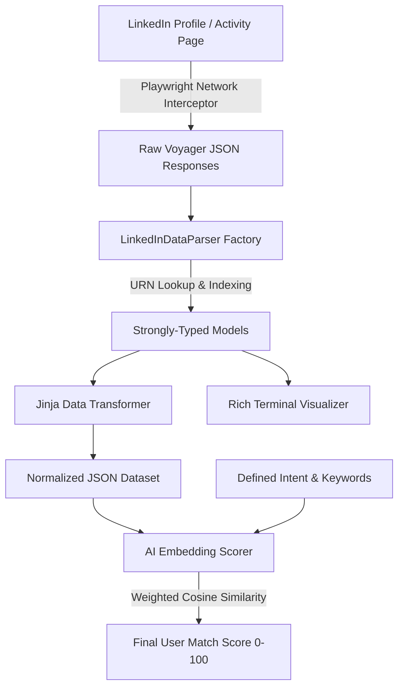

# 🚀 LinkedIn Operation — Data Interceptor, Voyager Parser & AI Activity Scorer

[](https://www.python.org/)
[](https://playwright.dev/)
[](https://www.sbert.net/)
[](https://github.com/Textualize/rich)
[](https://jinja.palletsprojects.org/)

---

## 📌 GitHub Repository Details

* **Suggested Repository Name:** `LinkedInOperation` *(Alternative: `linkedin-activity-ai-scorer`)*
* **Repository Short Description:** 
  > *"Automated LinkedIn activity interceptor, Voyager GraphQL parser, and AI-powered semantic similarity scoring engine for prospect and lead intelligence."*

---

## 📖 Overview

**LinkedIn Operation** is an end-to-end Python framework designed to intercept raw network responses from LinkedIn's internal Voyager GraphQL API, parse indexed entity graphs into strongly-typed object models, transform activity data, and compute **AI-driven semantic similarity scores** against predefined target intents.

Whether analyzing user activity (Posts, Comments, Reactions, Shares, Profile Info) for recruitment, lead scoring, market research, or candidate evaluation, this system transforms raw unstructured LinkedIn network logs into actionable intelligence.

---

## ✨ Key Features

* **🌐 Network Response Interception:** Uses Playwright persistent browser contexts to intercept and save raw Voyager GraphQL API JSON responses (`voyagerFeedDashProfileUpdates...`).
* **🧩 Voyager Entity Parser & Indexer:** Resolves complex LinkedIn URN references and index maps into strongly-typed object models (`Update`, `Comment`, `ActorComponent`, etc.).
* **🎨 Jinja Data Transformation Pipeline:** Renders raw JSON into normalized datasets using Jinja templates (`input-data.jinja` -> `output-data.json`).
* **🧠 AI Semantic Similarity Scoring:** Employs vector embeddings (`SentenceTransformers`) to compute similarity scores (0–100) between user activities and target intent/keywords.
* **📊 Weighted Activity Scorer:** Dynamically balances scoring weights across different engagement types (Posts: 40%, Comments: 30%, Reactions: 20%, Profile: 10%).
* **🖥️ Rich CLI Visualizer:** Provides visually appealing, color-coded terminal panels with interactive profile links for nested post threads, comments, and reactions.

---

## 🏗️ System Architecture



---

## 📂 Project Structure

```
LinkedInOperation/
├── get_data.py               # Playwright scraper to capture raw network JSON responses
├── get_content.py            # Browser navigation script for session management
├── input-data.py             # Jinja template rendering runner
├── input-data.jinja          # Jinja template for JSON normalization
├── comment_scraper.py        # Dedicated comment scraping script
├── posts_scraper.py          # Dedicated post scraping script
├── reaction_scraper.py       # Dedicated reaction scraping script
├── task.md                   # System design & scoring task specification
├── requirements.txt          # Python dependencies
│
├── models/                   # Strongly-typed object models
│   ├── base.py               # Base entity models & text components
│   ├── actor.py              # Actor, Profile, and Author models
│   ├── comment.py            # Comment schema and nested reply parsers
│   ├── update.py             # Feed Update (post/reaction) schema
│   └── response.py           # Typed collections & response wrappers
│
├── parsers/                  # Parsing logic & URN resolution
│   ├── factory.py            # Main Voyager JSON index parser factory
│   └── __init__.py
│
├── ui/                       # Terminal UI components
│   └── display.py            # Rich console visualizer for posts & comments
│
└── data/                     # Output storage (gitignored/local)
    ├── browser_data/         # Persistent Chromium profile directory
    └── network_responses/    # Intercepted raw JSON responses
```

---

## 🎯 AI Scoring Methodology

The scoring engine evaluates how closely a LinkedIn user's recent activity aligns with a specified **Intent Configuration**:

### Intent Configuration Structure
```json
{
  "keywords": ["AI", "Machine Learning", "LLMs", "Startups", "Innovation"],
  "description": "Looking for active builders and leaders in artificial intelligence and machine learning",
  "weights": {
    "posts": 0.40,
    "comments": 0.30,
    "reactions": 0.20,
    "profile": 0.10
  }
}
```

### Mathematical Formula

$$\text{Final Score} = 100 \times \left( W_{\text{posts}} \cdot S_{\text{posts}} + W_{\text{comments}} \cdot S_{\text{comments}} + W_{\text{reactions}} \cdot S_{\text{reactions}} + W_{\text{profile}} \cdot S_{\text{profile}} \right)$$

Where:
* $S_{\text{activity}} = \max \left( \text{CosineSimilarity}(\mathbf{E}_{\text{activity\_item}}, \mathbf{E}_{\text{intent}}) \right)$
* $\mathbf{E}$ represents sentence embedding vectors generated via model `all-MiniLM-L6-v2`.

---

## 🛠️ Installation & Setup

### 1. Clone the Repository
```bash
git clone https://github.com/YOUR_USERNAME/LinkedInOperation.git
cd LinkedInOperation
```

### 2. Set Up Virtual Environment & Install Dependencies
```bash
python3 -m venv env
source env/bin/activate

pip install -r requirements.txt
pip install playwright rich sentence-transformers pydantic
playwright install chromium
```

---

## 🚀 Quick Start Guide

### Step 1: Intercept & Capture LinkedIn Activity Data
Launch Playwright to navigate to recent activity pages and save GraphQL network payloads:
```bash
python get_data.py
```

### Step 2: Transform & Normalize Activity Data
Render raw JSON responses into structured output JSONs via Jinja templates:
```bash
python input-data.py
```

### Step 3: Run AI Scoring & View UI Breakdown
Parse updates, generate embeddings, and display rich console output:
```python
from parsers.factory import LinkedInDataParser
from ui.display import LinkedInDisplay

# Parse raw reaction payload
parser = LinkedInDataParser.from_file("reaction.json")
reactions = parser.parse_reactions()

# Display via Rich UI
display = LinkedInDisplay()
for update in reactions.updates:
    display.console.print(f"[bold cyan]Update:[/bold cyan] {update.commentary.text if update.commentary else 'N/A'}")
```

---

## 📄 License

Distributed under the MIT License. See `LICENSE` for details.
